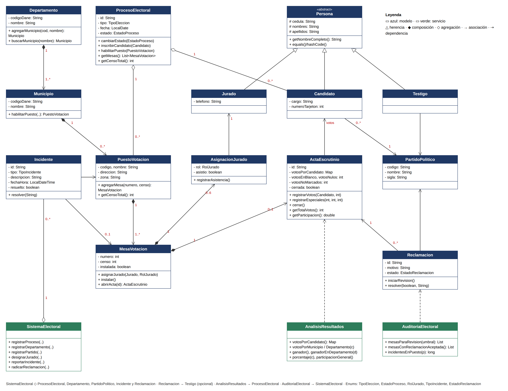

# Diagrama de clases

Versión Mermaid (GitHub la renderiza):

```mermaid
classDiagram
    direction LR
    class Persona {
        <<abstract>>
        #String cedula
        #String nombres
        #String apellidos
        +getNombreCompleto() String
    }
    Persona <|-- Candidato
    Persona <|-- Jurado
    Persona <|-- Testigo
    class ProcesoElectoral {
        -String id
        -TipoEleccion tipo
        -LocalDate fecha
        -EstadoProceso estado
        +cambiarEstado(EstadoProceso)
        +inscribirCandidato(Candidato)
        +habilitarPuesto(PuestoVotacion)
        +getMesas() List
        +getCensoTotal() int
    }
    class Departamento {
        -String codigoDane
        -String nombre
        +agregarMunicipio(codigo, nombre) Municipio
        +buscarMunicipio(nombre) Municipio
    }
    class Municipio {
        -String codigoDane
        -String nombre
        +habilitarPuesto(...) PuestoVotacion
    }
    class PuestoVotacion {
        -String codigo
        -String nombre
        -String direccion
        -String zona
        +agregarMesa(numero, censo) MesaVotacion
        +getCensoTotal() int
    }
    class MesaVotacion {
        -int numero
        -int censo
        -boolean instalada
        +asignarJurado(Jurado, RolJurado) AsignacionJurado
        +instalar()
        +abrirActa(id) ActaEscrutinio
    }
    class PartidoPolitico {
        -String codigo
        -String nombre
        -String sigla
    }
    class Candidato {
        -String cargo
        -int numeroTarjeton
    }
    class Jurado { -String telefono }
    class AsignacionJurado {
        -RolJurado rol
        -boolean asistio
        +registrarAsistencia()
    }
    class ActaEscrutinio {
        -String id
        -int votosEnBlanco
        -int votosNulos
        -int votosNoMarcados
        -boolean cerrada
        +registrarVotos(Candidato, int)
        +registrarEspeciales(int, int, int)
        +cerrar()
        +getTotalVotos() int
        +getParticipacion() double
    }
    class Incidente {
        -String id
        -TipoIncidente tipo
        -String descripcion
        -boolean resuelto
        +resolver(String)
    }
    class Reclamacion {
        -String id
        -String motivo
        -EstadoReclamacion estado
        +iniciarRevision()
        +resolver(boolean, String)
    }
    class SistemaElectoral {
        +registrarProceso(...) ProcesoElectoral
        +registrarDepartamento(...) Departamento
        +registrarPartido(...) PartidoPolitico
        +designarJurado(...) AsignacionJurado
        +reportarIncidente(...) Incidente
        +radicarReclamacion(...) Reclamacion
    }
    class AnalisisResultados {
        +votosPorCandidato() Map
        +votosPorMunicipio(Candidato) Map
        +votosPorDepartamento(Candidato) Map
        +ganador() Candidato
        +ganadorEnDepartamento(String) Candidato
        +participacionGeneral() double
    }
    class AuditoriaElectoral {
        +mesasParaRevision(double) List
        +mesasConReclamacionAceptada() List
        +incidentesEnPuesto(PuestoVotacion) long
    }
    Departamento "1" *-- "1..*" Municipio
    Municipio "1" *-- "0..*" PuestoVotacion
    PuestoVotacion "1" *-- "1..*" MesaVotacion
    ProcesoElectoral "1" o-- "0..*" PuestoVotacion
    ProcesoElectoral "1" o-- "0..*" Candidato
    Candidato "0..*" --> "1" PartidoPolitico
    Testigo --> PartidoPolitico
    MesaVotacion "1" *-- "0..6" AsignacionJurado
    AsignacionJurado --> Jurado
    MesaVotacion "1" *-- "0..1" ActaEscrutinio
    ActaEscrutinio --> Candidato : votos
    Incidente --> PuestoVotacion
    Incidente --> MesaVotacion
    Reclamacion --> ActaEscrutinio
    Reclamacion --> PartidoPolitico
    Reclamacion --> Testigo
    SistemaElectoral o-- ProcesoElectoral
    SistemaElectoral o-- Departamento
    SistemaElectoral o-- PartidoPolitico
    SistemaElectoral o-- Incidente
    SistemaElectoral o-- Reclamacion
    AnalisisResultados --> ProcesoElectoral
    AuditoriaElectoral --> SistemaElectoral
```
